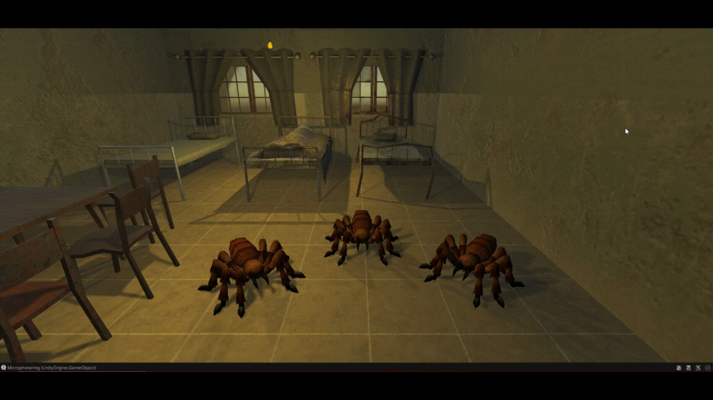
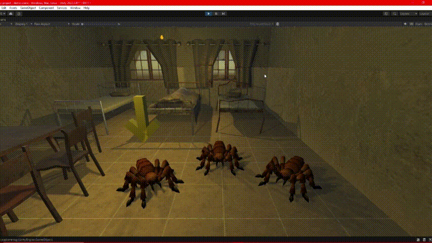

# II-Raimon-Mejias-P08-Reconocimiento-Voz
Repositorio que contiene los scripts realizados y un README con la descripción del trabajo de la práctica

## SelectionController
Script que se encarga de permitir selecionar a una de las arañas, además de comunicar a las arañas con el reconocimiento de voz.

```C#
public class SelectionController : MonoBehaviour
{

    [SerializeField] private GameObject arrow_;
    private GameObject selectedObject_;

    // Update is called once per frame
    void Update()
    {
        CheckKeys();
        if (selectedObject_ == null) { return; }
        arrow_.transform.position = selectedObject_.transform.position + Vector3.up;
        arrow_.SetActive(true);
    }

    private void CheckKeys() {
        if      (Input.GetKeyDown("1")) { selectedObject_ = GameObject.FindWithTag("SpiderA"); }
        else if (Input.GetKeyDown("2")) { selectedObject_ = GameObject.FindWithTag("SpiderB"); }
        else if (Input.GetKeyDown("3")) { selectedObject_ = GameObject.FindWithTag("SpiderC"); }
    }

    public void SetObjectText(string newText, bool isError = false) {
        if (selectedObject_ == null) { return; } 
        Transform canvas = selectedObject_.transform.GetChild(selectedObject_.transform.childCount - 1);
        canvas.GetChild(0).GetComponent<TMP_Text>().color = (isError)? Color.red : Color.white;
        canvas.GetChild(0).GetComponent<TMP_Text>().text = newText;
    }

    public string SetObjectAction(string action) {
        if (selectedObject_ == null) { return ""; }
        return selectedObject_.GetComponent<SpidersResponses>().Action(action);
    }
}
```



## SpidersResponds
Script que se encarga de ejecutar la acción seleccionada tras reconocer las palabras dichas por el usuario.

```C#
public class SpidersResponses : MonoBehaviour
{

    private Animation anim;

    private void Start() {
        anim = GetComponent<Animation>();
    }

    public string Action(string action) {
        action = action.Substring(0, action.Length - 1);
        string result;
        switch(action) {
   
            case " Jump":
                Debug.Log("Ejecutando la acción JUMP");
                anim.Play("jump");
                result = "Saltando";
                break;

            case " Attack":
                Debug.Log("Ejecutando la acción ATTACK");
                anim.Play("attack1");
                anim.PlayQueued("attack2", QueueMode.CompleteOthers);
                result = "Atacando";
                break;

            case " Run":
                Debug.Log("Ejecutando la acción RUN");
                anim.Play("run");
                result = "Corriendo"; 
                break;
            // ...
            default:
                Debug.Log("No se ha reconocido la acción!");
                result = "No te entiendo!";
                break;
        }
        anim.PlayQueued("idle", QueueMode.CompleteOthers);
        return result;
    }
```

## SpeechRecognition
Script del tutorial de HuggingFace para el reconocimiento de voz, tiene además pequeñas modificaciones para adecuarlo al programa hecho.

```C#
public class SpeechRecognition : MonoBehaviour {

    private AudioClip clip;
    private byte[] bytes;
    private bool recording;
    private SelectionController selectionController_;
    private GameObject microphoneImage_;
    
    private void Start() {
        selectionController_ = GameObject.FindWithTag("SelectionController").GetComponent<SelectionController>();
        microphoneImage_ = GameObject.FindWithTag("MicrophoneImg").transform.GetChild(0).gameObject;
        Debug.Log(microphoneImage_);
    }

    private void Update() {

        if (Input.GetKeyDown("r")) { 
            StartRecording(); 
            microphoneImage_.SetActive(true);
        }
        else if (Input.GetKeyDown("s")) { 
            StopRecording();  
            microphoneImage_.SetActive(false);
        }
        if (recording && Microphone.GetPosition(null) >= clip.samples) {
            StopRecording();
        }
    }
   // ...
    private void SendRecording() {
        HuggingFaceAPI.AutomaticSpeechRecognition(bytes, 
            response => {
                selectionController_.SetObjectText(selectionController_.SetObjectAction(response));
            }, error => {
                selectionController_.SetObjectText(error, true);
            }
        );
    }
```



